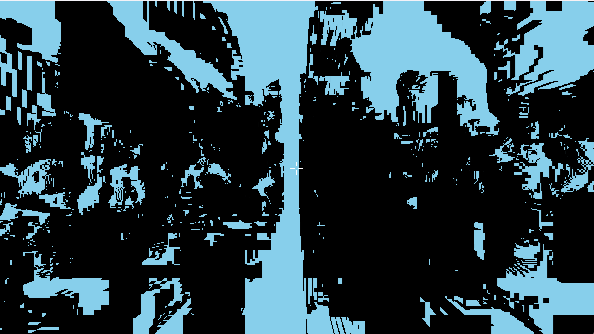

# 🐉 Dracolich — The Governed Swarm

**1,824 lines of TypeScript that built a 16,627-line Rust voxel engine overnight.**

Dracolich is a governed multi-agent swarm engine. Give it a task in plain English. It decomposes the problem into a dependency-aware execution graph, designs its own team of specialized agents, runs them in parallel, and enforces adversarial governance at every stage.

No agent can both propose and approve. Every decomposition gets challenged. Every output gets reviewed. The swarm goes fast but can't go wrong fast.

## What It Does

Give it any task — build software, research a topic, analyze a codebase, write documentation. Dracolich figures out what agents it needs, creates them, and runs them in parallel with governance oversight.

```
Your task (any task)
         ↓
   [META_DECOMPOSER] → breaks task into dependency DAG, designs agent team
         ↓
   [ARBITER] → challenges the decomposition — is this plan sane?
         ↓
   Dynamically-created agent teams execute in parallel groups
         ↓
   [REAPER] → adversarial red-team review of final output
         ↓
   [REVISER/FIXER] → improvement loop if REAPER finds issues
         ↓
   Final output → your project directory
```

To stress-test this, we gave it an absurd prompt: *"Build Minecraft from scratch"* — a ~600-word spec with technical constraints and success criteria ([full prompt](examples/prompts/minecraft-from-scratch.md)). It produced:
- 60 Rust source files across 11 modules (renderer, physics, world gen, mobs, inventory, UI...)
- Raw OpenGL 3.3 — no game engine, no voxel libraries
- Procedural terrain with caves, trees, ore veins, water
- First-person movement, jumping, collision detection
- 48 inter-agent documentation files the agents wrote for *each other*

The Minecraft clone isn't the point. It's the stress test. The point is: one prompt in, working project out.

## How Agents Work

Dracolich has **5 fixed engine-level agents** and creates **unlimited task-specific agents** on the fly.

### Fixed Agents (hardcoded in the engine)

| Agent | Job |
|-------|-----|
| META_DECOMPOSER | Analyzes the task, designs a dependency DAG, and invents a custom agent team |
| ARBITER | Reviews the META_DECOMPOSER's plan before any execution begins |
| REAPER | Adversarial red-team review of the final output |
| REVISER | Rewrites output based on REAPER's critique |
| FIXER | Applies file-level fixes in the project directory |

### Dynamic Agents (created per task)

The META_DECOMPOSER designs a custom team for every task. For "Build Minecraft from scratch," it invented 17 agents:

```
PROJECT_ARCHITECT    → Cargo.toml, module structure, core types
SHADER_ENGINEER      → All GLSL shaders
OPENGL_RENDERER      → OpenGL rendering backend, mesh systems
WINDOW_MANAGER       → Windowing, input handling, game loop
WORLD_GENERATOR      → Procedural terrain with noise functions
CHUNK_SYSTEM         → Chunk storage, loading, meshing
PHYSICS_ENGINE       → Collision detection, physics simulation
PLAYER_CONTROLLER    → First-person movement, health, interaction
INVENTORY_CRAFTER    → Inventory and crafting systems
MOB_DEVELOPER        → Mob AI, spawning, combat
UI_DEVELOPER         → All 2D UI elements
AUDIO_ENGINEER       → Sound effects and ambient audio
INTEGRATION_ENGINEER → Wires all systems together
TEXTURE_ARTIST       → Texture atlas and block definitions
DOCUMENTATION_WRITER → Architecture docs and guides
QA_VALIDATOR         → Code review for correctness and safety
FINAL_ASSEMBLER      → Final review and deliverable assembly
```

Different task → different team. A research task gets HUNTER, SCOUT, ANALYST, VERIFIER agents instead. The engine doesn't know what agents it'll need until it sees the task.

## The Lineage

Dracolich didn't appear from nothing. It's the product of 40+ iterations across two parallel tracks — a swarm execution engine and a governance framework — that eventually merged.

### The Swarm Track (6 generations)

| Gen | What Happened |
|-----|--------------|
| 1 | 6 parallel research agents, linear execution |
| 2 | 100 topics with council voting |
| 3 | CEO orchestrator, QA gates, state management |
| 4 | 25 agents across multi-pipeline |
| 5 | Recursive decomposition, 20+ agents, 4,682 files — **got API-banned** |
| **6** | **Dracolich. Governed swarm. Same power, separation of powers.** |

### The Governance Track: [AgentBoardroom](https://github.com/GixGosu/AgentBoardroom) (25 attempts)

25 builds. 24 failures. Each failure revealed a governance pattern:

- **Attempts 1-5:** Single coordinator → always drifts (the Rogue CEO problem)
- **Attempts 6-12:** Added review → catches 60% of bad output, but post-hoc
- **Attempts 13-18:** Added adversarial challenge → better decisions, but infinite debates and budget blowouts
- **Attempts 19-24:** Added audit + gates → subtle failures (gaming gates, context pollution, rogue spawning)
- **Attempt 25:** Full committee governance. 12+ hours, 4 concurrent projects, zero human intervention needed.

The lesson from all 25: **don't build a better king, build a government.**

### The Merge

Dracolich takes Gen 5's recursive swarm execution and applies AgentBoardroom's governance patterns: adversarial challenge (ARBITER), red-team review (REAPER), and the principle that no agent can both propose and approve. Then it self-evolved through 12 more versions.

**Total iterations to get here: 40+.** This is not a weekend project.

## Self-Evolution

Dracolich wrote itself. The `evolve.sh` script runs self-improvement loops:

- Every hour, the current version can analyze its own source code and write an improved version
- 8-hour cap per evolution session
- Evolved from v1 → v12 autonomously (v12 is this release) before hitting a plateau
- 23/23 tests passing, clean compilation

## Architecture

```
src/
├── index.ts          — Entry point & CLI
├── decomposer.ts     — META_DECOMPOSER: task → dependency DAG + agent team design
├── orchestrator.ts   — DAG execution engine, parallel group runner
├── governance.ts     — ARBITER challenge gate, REAPER review, REVISER/FIXER loop
├── pool.ts           — Execution pool: spawns Claude CLI processes with retry logic
├── prompts.ts        — Loads fixed agent prompts from agents/ directory
├── constants.ts      — Timeouts, token limits, governance defaults
├── types.ts          — Type definitions
├── test.ts           — 23 tests
└── utils/            — File ops, formatting, JSON parsing
```

### How Agents Communicate

Agents coordinate through a **shared filesystem + DAG sequencing**:

1. **Shared project directory** — All agents write to the same output folder. Each agent reads what prior agents produced.
2. **DAG-driven sequencing** — Group 1 agents run in parallel, their outputs feed into Group 2 agents as context, and so on.
3. **Inter-agent documentation** — Agents spontaneously write handoff docs for downstream agents (e.g., `HANDOFF_WORLD_GENERATOR.md`, `MOB_INTEGRATION_GUIDE.md`). Nobody tells them to do this.

## Prerequisites

- **Node.js** (v18+)
- **[Claude CLI](https://docs.anthropic.com/en/docs/claude-cli)** — installed and authenticated (`claude` must be available in your PATH)

Dracolich spawns Claude CLI sessions for each agent — it does not call the Anthropic API directly. Your Claude CLI subscription covers the usage.

## Usage

```bash
npm install
npx tsx src/index.ts --file examples/prompts/minecraft-from-scratch.md
```

Or with a direct task:

```bash
npx tsx src/index.ts "Build a CLI tool that converts CSV to JSON with streaming support"
```

Output lands in `./output/<timestamp>-<task-slug>/`.

### Options

```bash
npx tsx src/index.ts "task" --fail-fast    # Abort on first agent failure
npx tsx src/index.ts "task" --verbose      # Show full REAPER review output
```

### Self-Improvement

```bash
chmod +x evolve.sh
./evolve.sh  # Runs up to 8 hours, improving itself each iteration
```

## Safety

Configured in `config/defaults.yaml`:

- **Max recursion depth: 3** — decompose → sub-decompose → micro-task, no deeper
- **Max concurrent agents: 10** (configurable)
- **Max agents per run: 50** (configurable)
- **Rate limiting** — per-provider request/token limits with jitter between spawns
- **Timeouts** — 3-hour max per agent, 30-min max for governance, per-phase timeouts
- **Fail-fast mode** — `--fail-fast` flag aborts on first agent failure
- **ARBITER rejection** — if the plan is bad, execution doesn't start

Rate limiting is non-negotiable. We learned that the hard way.

## Capability Demos

### Minecraft Clone (Rust + Raw OpenGL)

One prompt: *"Build Minecraft from scratch."* No engine. No voxel libraries.

The prompt specified Rust + raw OpenGL with no game engine. The swarm produced 60 source files, 16,627 lines of code, across 11 modules. Two human fixes total.

**Build 1** — First compile. The renderer runs but the shader pipeline is broken — everything renders as two-tone black and cyan silhouettes. But the geometry is there: voxel terrain, a crosshair, first-person camera. The structure works, the visuals don't.



**Build 3** — Two fixes later. Textured blocks, trees, terrain variety. Then we fixed mouse look and turned the camera around — discovered the swarm had already built water with transparency, ore veins in cave walls, and more. It was all there the whole time. We were judging the output through a keyhole.


The swarm also generated 48 markdown documents — architecture guides, handoff docs, integration specs — that the agents wrote *for each other* during development. Nobody told them to do this.

### Cyberpunk Roguelike

Same prompt given to the swarm and to solo Claude. Results:

| | Dracolich (Swarm) | Claude (Solo) |
|---|---|---|
| Files | 38 | 1 |
| Lines of code | 8,600 | 912 |
| What actually worked | Enemy AI, pathfinding, FOV, combat, items | Only movement |

Specialists going deep on each domain beat one generalist going wide across all of them.

## Configuration

`config/defaults.yaml` controls:

- **Safety** — recursion depth, concurrency, agent limits
- **Rate limits** — request/token/concurrency limits with spawn jitter
- **Governance** — ARBITER revision rounds, REAPER iteration limits, timeouts
- **Execution** — phase timeouts, checkpoint behavior, reporting channel
- **Models** — which Claude model each role uses (orchestrator, research, governance, builder)

## License

MIT

## Author

Built by [@brineshrimp](https://github.com/GixGosu) — Localization Automation Engineer at Epic Games, founder of BrineShrimp Games.

The swarm that got banned, came back governed, and built itself.

## See Also

- **[AgentBoardroom](https://github.com/GixGosu/AgentBoardroom)** — The governance framework that informed Dracolich's architecture. 25 iterations of failure modes and fixes, documented in detail. If Dracolich is the engine, AgentBoardroom is the constitutional law it runs on.
