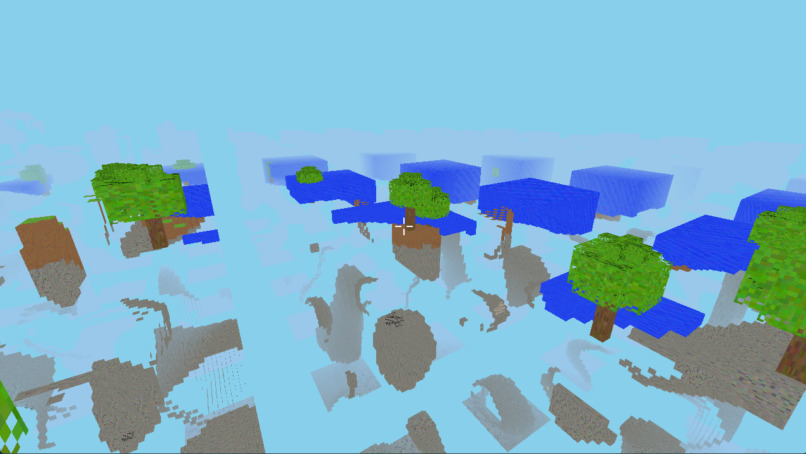

# 🐉 Dracolich — The Governed Swarm

**1,824 lines of TypeScript that built a 16,627-line Rust voxel engine overnight.**

Dracolich is a governed multi-agent swarm engine. Give it a task in plain English. It decomposes the problem into a dependency-aware execution graph, spins up specialized AI agents in parallel, and enforces adversarial governance at every fork and merge.

No agent can both propose and approve. Every decomposition gets challenged. Every output gets reviewed. The swarm goes fast but can't go wrong fast.

## What It Does

```
"Build Minecraft from scratch"
         ↓
   [META_DECOMPOSER] → breaks task into dependency DAG
         ↓
   [ARBITER] → challenges the decomposition
         ↓
   Parallel agent teams execute task groups
         ↓
   [SENTINEL] → quality gate on each output
         ↓
   [REAPER] → adversarial red-team review
         ↓
   Final output → your project directory
```

One prompt produced:
- 60 Rust source files across 11 modules (renderer, physics, world gen, mobs, inventory, UI...)
- Raw OpenGL 3.3 — no game engine
- Procedural terrain with caves, trees, ore veins, water
- First-person movement, jumping, collision detection
- 48 inter-agent documentation files the agents wrote for *each other*

## The Lineage

Dracolich is the 6th generation of a recursive agent system:

| Gen | What Happened |
|-----|--------------|
| 1 | 6 parallel research agents, linear execution |
| 2 | 100 topics with council voting |
| 3 | CEO orchestrator, QA gates, state management |
| 4 | 25 agents across multi-pipeline |
| 5 | Recursive decomposition, 20+ agents, 4,682 files — **got API-banned** |
| **6** | **Dracolich. Governed swarm. Same power, separation of powers.** |

## Self-Evolution

Dracolich wrote itself. The `evolve.sh` script runs self-improvement loops:

- Every hour, the current version analyzes its own source code and writes an improved version
- 8-hour cap per evolution session
- Evolved from v1 → v12 autonomously (v12 is this release)
- 23/23 tests passing, clean compilation

## Architecture

```
src/
├── index.ts          — Entry point & CLI
├── decomposer.ts     — Task → dependency DAG
├── orchestrator.ts   — DAG execution engine
├── governance.ts     — ARBITER + SENTINEL + REAPER gates
├── pool.ts           — Agent execution pool & concurrency
├── prompts.ts        — Agent prompt templates
├── constants.ts      — Token limits, budgets, config
├── types.ts          — Type definitions
├── test.ts           — 23 tests
└── utils/            — File ops, formatting, JSON parsing
```

### Agent Roles

| Agent | Layer | Job |
|-------|-------|-----|
| DRACOLICH | Command | Meta-orchestrator. Decomposes tasks, builds DAGs |
| WARDEN | Command | Monitor + circuit breaker. Token budgets, kill switch |
| ARBITER | Governance | Reviews decompositions before execution begins |
| SENTINEL | Governance | Reviews outputs before aggregation |
| REAPER | Adversarial | Red team. Challenges assumptions, finds gaps |
| HUNTER | Research | Deep research, citation chasing |
| SCOUT | Research | Breadth research, contrarian perspectives |
| ARCHITECT | Builder | Designs implementation plans |
| BUILDER | Builder | Code/doc generation, one per sub-task |
| QA | Builder | Testing and validation |

## Usage

```bash
npm install
npx tsx src/index.ts --file prompts/minecraft-from-scratch.md
```

Or with a direct task:

```bash
npx tsx src/index.ts "Build a CLI tool that converts CSV to JSON with streaming support"
```

Output lands in `./output/<timestamp>-<task-slug>/`.

### Self-Improvement

```bash
chmod +x evolve.sh
./evolve.sh  # Runs up to 8 hours, improving itself each iteration
```

## Safety Constraints

These are non-negotiable:

1. **Max recursion depth: 3** — decompose → sub-decompose → micro-task, no deeper
2. **Configurable concurrent agent limit** — starts at 10
3. **Token budget per run** — estimated before execution, hard cap enforced
4. **Human approval** — required for depth > 2 or budget overruns
5. **Kill switch** — one command stops everything
6. **Rate limiting** — provider-aware, learned the hard way

## Capability Demos

### Minecraft Clone (Rust + Raw OpenGL)

One prompt: *"Build Minecraft from scratch."* No engine. No voxel libraries.

The swarm chose Rust + raw OpenGL on its own. Produced 60 source files, 16,627 lines of code, across 11 modules. Two human fixes total.

**Build 1** — First compile. It crashes.


**Build 5** — Two fixes later. Really the same as Build 3 but with working mouse look — once we could actually turn the camera around, we discovered the swarm had already built water with transparency, ore veins in cave walls, varied terrain, and more. It was all there the whole time. We were judging the output through a keyhole.



The swarm also generated 48 markdown documents — architecture guides, handoff docs, integration specs — that the agents wrote *for each other* during development. Nobody told them to do this.

### Cyberpunk Roguelike

Same prompt given to the swarm and to solo Claude. Results:

| | Dracolich (Swarm) | Claude (Solo) |
|---|---|---|
| Files | 38 | 1 |
| Lines of code | 8,600 | 912 |
| What actually worked | Enemy AI, pathfinding, FOV, combat, items | Only movement |

Specialists going deep on each domain beat one generalist going wide across all of them.

## Configuration

Edit `config/defaults.yaml` for:
- Max concurrency
- Token budgets
- Recursion depth limits
- Model selection

## License

MIT

## Author

Built by [@brineshrimp](https://github.com/GixGosu) — Localization Automation Engineer at Epic Games, founder of BrineShrimp Games.

The swarm that got banned, came back governed, and built itself.
